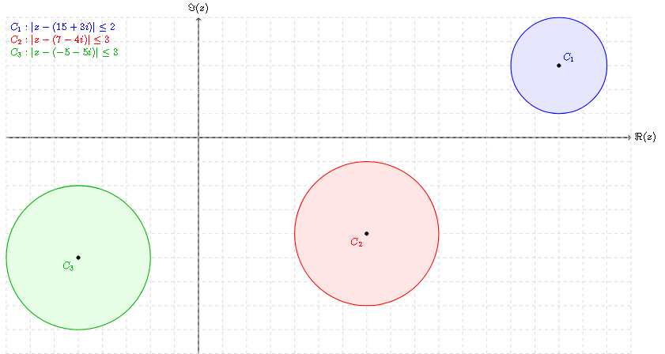

# Ejercicio 5

## Consigna

Sea $A = \begin{pmatrix}
15 + 3i & 1 & 1 \\
2 & 7 - 4i & 1 \\
1 & 2 & -5 - 5i
\end{pmatrix}$. Justificar si las siguientes afirmaciones son verdaderas o falsas:

1. $A$ es diagonalizable.
2. $A$ es invertible.
3. $A$ tiene al menos un valor propio real.

## Resolución

Veamos cuales son los círculos de Gershgorin:

- $C_1 = \{z \in \mathbb{C} : |z - (15 + 3i)| \leq 2\}$
- $C_2 = \{z \in \mathbb{C} : |z - (7-4i)| \leq 3\}$
- $C_3 = \{z \in \mathbb{C} : |z - (-5 - 5i)| \leq 3\}$

Veamos como se ve gráficamente para determinar si hay intersección entre los círculos:

Entonces, usando el gráfico podemos determinar que:

1. VERDADERO, ya que los círculos de Gershgorin no se intersectan entre si.
2. VERDADERO, ninguno de los círculos de Gershgorin contiene al 0.
3. FALSO, ya que no hay intersección entre los círculos de Gershgorin y el eje real.