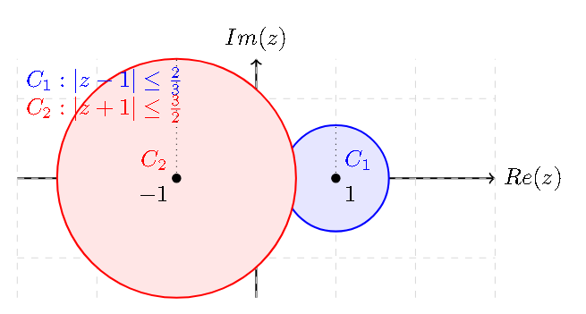

# Ejercicio 6

## Consigna

El Teorema de Gerschgorin permite determinar si $A = \begin{pmatrix}
1 & 2/3 \\
-3/2 & -1
\end{pmatrix}$ es diagonalizable? Justificar.

## Resolución

Veamos cuales son los círculos de Gershgorin:

- $C_1 = \{z \in \mathbb{C} : |z - 1| \leq 2/3\}$
- $C_2 = \{z \in \mathbb{C} : |z - (-1)| \leq 3/2\}$

Veamos como se ve gráficamente para determinar si hay intersección entre los círculos:

Claramente, los círculos se intersectan, por lo que el teorema de Gershgorin no nos permite determinar si la matriz es diagonalizable.

Esto porque la parte (2) del mismo teorema nos dice que la unión $C_1 \cup C_2$ contiene 2 valores propios o un valor propio con multiplicidad 2. Esto no es suficiente para determinar si la matriz es diagonalizable, ya que en el segundo caso deberíamos calcular la multiplicidad geométrica para determinar si es diagonalizable. 

Veamos también un argumento algebraico.
Llamemos $\lambda_i$ al valor propio correspondiente al círculo $C_i$.
En base a los círculos, podemos decir que:

- $Re(\lambda_1) \in C_1 \Rightarrow \frac{1}{3} \leq Re(\lambda_1) \leq \frac{5}{3}$
- $Re(\lambda_2) \in C_2 \Rightarrow \frac{-5}{2} \leq Re(\lambda_2) \leq \frac{1}{2}$

Esto claramente indica que hay intersección entre los círculos.